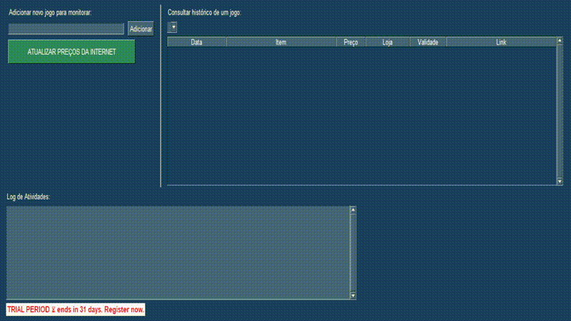

# 🎮 Finder v2.0 - Monitor Inteligente de Preços de Jogos

  


Um aplicativo de desktop em **Python** para localizar promoções de jogos, DLCs e expansões, salvando o histórico de preços em um banco **SQLite** e exibindo tudo em uma interface simples com **PySimpleGUI**.

---

## ✨ Visão Geral

Com o Finder, você pode:  
- Adicionar jogos à sua lista de monitoramento.  
- Atualizar preços e promoções direto da API [IsThereAnyDeal](https://isthereanydeal.com/apps/api/).  
- Consultar o histórico de preços em uma tabela interativa.  

📸 **Capturas de Tela**  

 
*(Exemplo da interface principal do Finder)*  

🎞️ **Demo em Ação**  

  
*(Exemplo de busca, atualização e consulta ao histórico)*  

---

## 📜 História do Projeto

A ideia surgiu quando precisei comprar DLCs do jogo **Northgard**.  
Enquanto algumas expansões estavam em promoção na **Nuuvem**, outras só apareciam na **Steam** — e os preços variavam bastante.  
Comparar manualmente foi frustrante, e então nasceu o **Finder**: um app para centralizar tudo em um só lugar.  

O projeto foi desenvolvido com auxílio das IAs **Gemini (Google)** e **ChatGPT (OpenAI)** como parceiras de brainstorming e depuração.  

---

## 🚀 Funcionalidades

- **Interface Gráfica** feita em PySimpleGUI.  
- **Busca Inteligente** de jogos + DLCs/expansões.  
- **Histórico Persistente** no SQLite.  
- **Cache Inteligente** para evitar chamadas desnecessárias à API.  
- **Normalização de Nomes** (ex.: entende que “Diablo IV” e “Diablo 4” são o mesmo jogo).  
- **Exportação** para `.csv` via `exportador.py`.  

---

## 🛠️ Tecnologias

- [Python 3.12+](https://www.python.org/)  
- [PySimpleGUI](https://pysimplegui.readthedocs.io/en/latest/)  
- [SQLite3](https://www.sqlite.org/)  
- [Requests](https://pypi.org/project/requests/)  
- [IsThereAnyDeal API](https://isthereanydeal.com/apps/api/)  

---

## ⚙️ Instalação e Configuração

1. **Clone este repositório**
   ```bash
   git clone https://github.com/SEU_USUARIO/buscador_jogos.git
   cd buscador_jogos

2. **Crie e ative um ambiente virtual**
```bash
python -m venv .venv
.\.venv\Scripts\activate   # Windows
```

3. **Instale as dependências**
```bash
pip install -r requirements.txt
```

4. **Configure sua chave da API**
Crie um arquivo `config.json` na raiz do projeto:
```json
{
  "API_KEY": "sua_chave_da_api_aqui"
}
```
Chave obtida em: [IsThereAnyDeal API](https://isthereanydeal.com/apps/api/).

---

## ▶️ Como Usar

1. Execute a interface gráfica:
```bash
python finder_GUI.py
```

2. Na janela:
   - Digite o nome de um jogo e clique em **Adicionar**.  
   - Clique em **Atualizar preços da Internet** para salvar ofertas.  
   - Selecione o jogo no dropdown para ver o **histórico**.  

3. Para exportar os resultados para CSV:
```bash
python exportador.py
```

---

## 🖼️ Capturas de Tela

  
*(Exemplo de busca, atualização e consulta ao histórico)*   

---

## 🗺️ Roadmap

- [ ] Estatísticas: menor preço histórico, média de preços, etc.  
- [ ] Gráficos com evolução de preços no tempo.  
- [ ] Versão Web (Flask/Streamlit) para acessar via navegador.  
- [ ] Alertas automáticos de promoções.  

---

## 🙏 Agradecimentos

- [IsThereAnyDeal](https://isthereanydeal.com/) pela API pública.  
- [PySimpleGUI](https://pysimplegui.readthedocs.io/en/latest/) por simplificar GUIs em Python.  
- **Gemini (Google)** e **ChatGPT (OpenAI)** como parceiros de brainstorming, depuração e aprendizado.  

---

## 📄 Licença

Este projeto está sob a licença MIT. Veja o arquivo `LICENSE` para mais detalhes.

